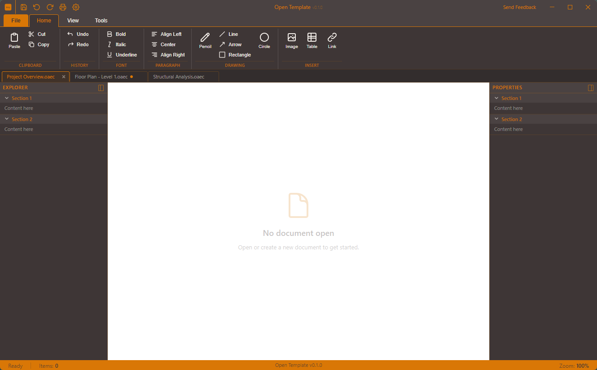
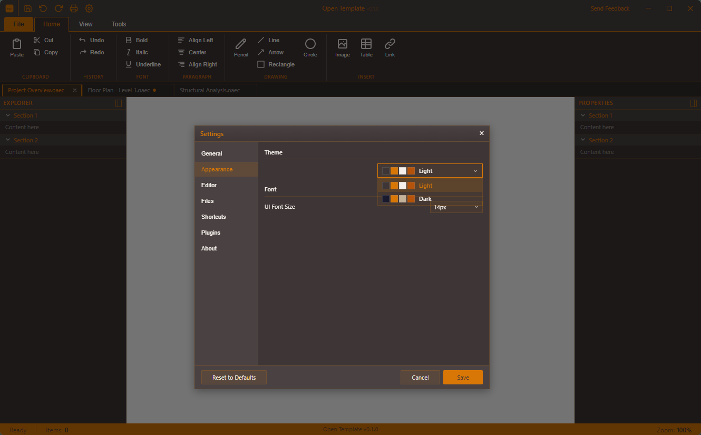

<p align="center">
  
</p>

<h3 align="center">Build free. Build together.</h3>

<p align="center">
  Free and open-source tools for the built environment.
</p>

<p align="center">
  <a href="LICENSE"></a>
  <a href="https://github.com/OpenAEC-Foundation/OpenAEC_stijlbook/issues"></a>
</p>

---

## About

This repository contains the **OpenAEC Foundation brand identity** — the complete visual language for our open-source AEC tools. Everything you need to build on-brand: logo's, color palette, typography, illustrations, and design system tokens.

## Desktop Application Template

A ready-to-use **Tauri v2 + React + TypeScript** template for building cross-platform desktop applications with the OpenAEC visual identity. All apps built from this template share the same look and feel.

<p align="center">
  
</p>

<p align="center">
  
</p>

**Includes:** Ribbon toolbar with animated tab switching, document tab bar, backstage file menu, side panels, status bar, custom frameless titlebar, i18n (EN/NL), persistent settings, themed dropdowns, and two themes (Light & Dark).

See [`project-templates/Tauri+React/`](project-templates/Tauri+React/) for setup instructions.

## What's inside

```
brandbook/
├── BRANDBOOK.md              # Full brand guidelines
├── DESIGN-SYSTEM.md          # Machine-readable design tokens & components
├── styleguide.html           # Rendered visual reference
└── assets/
    ├── logo/                 # Logo in SVG, PNG (1x/2x/3x), PDF
    │   ├── svg/              # Master vector source files
    │   ├── png/              # Raster exports at 72/144/216 DPI
    │   └── pdf/              # Print-ready vector exports
    ├── illustrations/        # Header & background illustrations
    │   ├── svg/              # Master vector source files
    │   └── png/              # Raster exports at 72/144/216 DPI
    ├── colors/               # Color palette reference + CMYK specs
    └── export_assets.py      # Script to regenerate PNG/PDF from SVG
project-templates/
└── Tauri+React/              # Desktop app template (Tauri v2 + React + TS)
packages/
└── tokens/                   # Machine-readable design tokens (npm package)
```

## Machine-readable tokens

The design tokens specified in [`brandbook/DESIGN-SYSTEM.md`](brandbook/DESIGN-SYSTEM.md) §2 are also available as a machine-readable npm package in [`packages/tokens/`](packages/tokens/). Use this when integrating OpenAEC tokens into an application (Tailwind preset, CSS variables, or JS import).

See [`packages/tokens/README.md`](packages/tokens/README.md) for usage.

## Quick reference

| Token | Value |
|-------|-------|
| **Primary color** | `#D97706` Construction Amber |
| **Dark background** | `#36363E` Deep Forge |
| **Headings** | Space Grotesk 700 |
| **Body text** | Inter 400 |
| **Code** | JetBrains Mono 400 |
| **Gradient** | `linear-gradient(90deg, #D97706, #F59E0B, #EA580C)` |

All fonts are open-source (SIL Open Font License).

## Usage

### Use the logo

Pick the right variant for your context:

| Context | Variant |
|---------|---------|
| Dark backgrounds | `openaec-logo-amber-on-dark` |
| Light backgrounds | `openaec-logo-dark-on-light` |
| Monochrome / grayscale | `openaec-logo-white-on-dark` |
| Favicon / avatar | `openaec-symbol-transparent` |

### Use the design tokens

Copy the CSS starter from [`DESIGN-SYSTEM.md`](brandbook/DESIGN-SYSTEM.md#9-css-starter) into your project, or use the [Tailwind config](brandbook/DESIGN-SYSTEM.md#10-tailwind-css-mapping).

### Regenerate assets

```bash
python brandbook/assets/export_assets.py
```

Requires `cairosvg` and `svglib`. Exports PNG at 1x/2x/3x and PDF from SVG masters.

## Guidelines

- Read [`BRANDBOOK.md`](brandbook/BRANDBOOK.md) for the full brand story, tone of voice, and do's & don'ts.
- Read [`DESIGN-SYSTEM.md`](brandbook/DESIGN-SYSTEM.md) for implementation-ready tokens, component specs, and layout templates.
- The logo minimum size is 32px (digital) / 10mm (print).
- Always maintain a clearance zone of 1x the logo height around the logo.
- Never use Construction Amber as a background fill — it's an accent color.

## Contributing

We welcome contributions. Whether it's fixing a typo, adding a new asset, or translating the docs — every bit helps.

1. Fork this repository
2. Create a feature branch (`git checkout -b add-social-templates`)
3. Commit your changes
4. Open a pull request

First PR? Welcome. Check the [issues](https://github.com/OpenAEC-Foundation/OpenAEC_stijlbook/issues) for a good starting point.

## License

This work is licensed under [CC BY-SA 4.0](https://creativecommons.org/licenses/by-sa/4.0/) — you are free to share and adapt, as long as you give credit and share alike.

---

<p align="center">
  <sub>OpenAEC Foundation — Own your tools.</sub>
</p>
